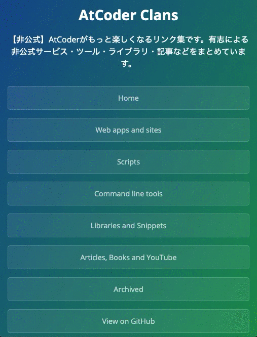

# Daily-hit

Wants to make &amp; prototype list inspired by [the page](https://masuidrive.tadalist.com/lists/1941485/public)

## Idea list

[Click here!](https://github.com/KATO-Hiro/Daily-hit/blob/master/idea_list.md)

## Found

[Click here!](https://github.com/KATO-Hiro/Daily-hit/blob/master/found.md)

## Released products

### [AtCoderClans](https://github.com/KATO-Hiro/AtCoderClans)

  ***DEMO***

  

+ Date: 2020-07-11〜
+ Summary: AtCoderに関する非公式サービス・ツールの一覧を表示するページです。
+ Keywords: 競技プログラミング、AtCoder、非公式サービス・ツール、リンク集
+ Links:
  + [GitHub](https://github.com/KATO-Hiro/AtCoderClans)
  + [Twitter](https://twitter.com/k_hiro1818/status/1287020528247517184)
  + [Issue](https://github.com/KATO-Hiro/Daily-hit/issues/102)

### [AtCoderChokuZen](https://twitter.com/k_hiro1818/status/1279761953037021185)

  ***DEMO***

  

+ Date: 2020-07-04〜
+ Summary: AtCoderのコンテスト開催当日に、開催情報をスマートフォンにpush通知します。
+ Keywords: リマインダー、競技プログラミング、AtCoder、コンテスト、push通知
+ Links:
  + [Twitter](https://twitter.com/AtCoderChokuZen)
  + [GitHub](https://github.com/KATO-Hiro/AtCoderChokuZen)
  + [Issue](https://github.com/KATO-Hiro/Daily-hit/issues/11)

### [AtCoder Jump to Submissions from Standings](https://greasyfork.org/ja/scripts/397528-atcoder-jump-to-submissions-from-standings)

  ***DEMO***

  

+ Date: 2020-03-08〜
+ Summary: AtCoderの順位表の得点をダブルクリックすると、該当するコンテスタントの実装を見ることができます。
+ Keywords: 競技プログラミング、AtCoder、ユーザスクリプト、効率化
+ Links:
  + [Greasy Fork](https://greasyfork.org/ja/scripts/397528-atcoder-jump-to-submissions-from-standings)
  + [Twitter](https://twitter.com/k_hiro1818/status/1236644205176311808)
  + [GitHub](https://github.com/KATO-Hiro/AtCoder-Jump-to-Submissions-from-Standings)
  + [Issue](https://github.com/KATO-Hiro/Daily-hit/issues/21)

## Links

[Source](https://masuidrive.tadalist.com/lists/1941485/public)

[Idea note](https://qiita.com/terubooon/items/08c145aac0dd10ea8cbc)

[Tips for continuing development using weekdays](https://docs.google.com/presentation/d/1WYo14faJY9LVSAazTT3_FCoCYv48JODZlZO7rppuZPQ/edit#slide=id.g89fd1a9fd7_2_75)

[Readme Driven Development; RDD](https://qiita.com/b4b4r07/items/c80d53db9a0fd59086ec)

## Author

[@KATO-Hiro](https://twitter.com/k_hiro1818)

## License

[MIT](http://KATO-Hiro.mit-license.org)
